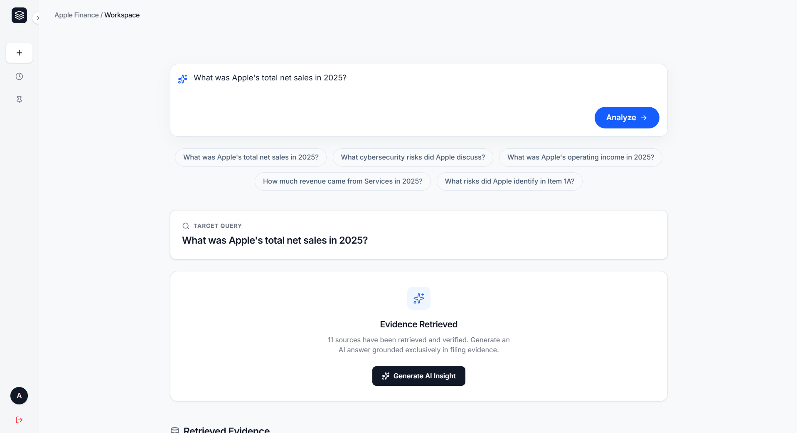
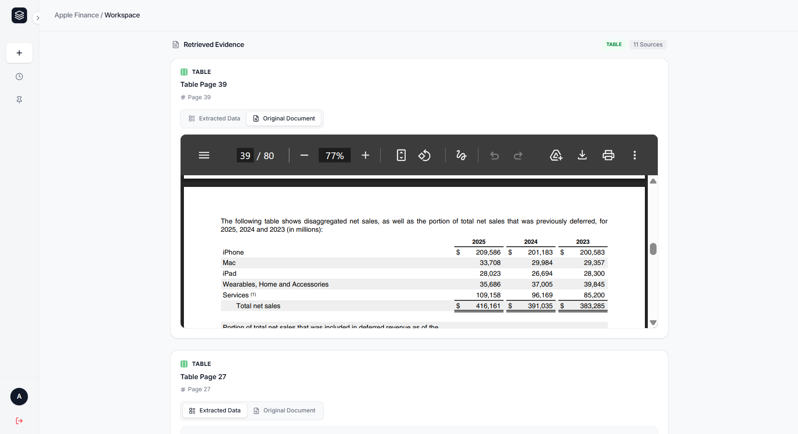
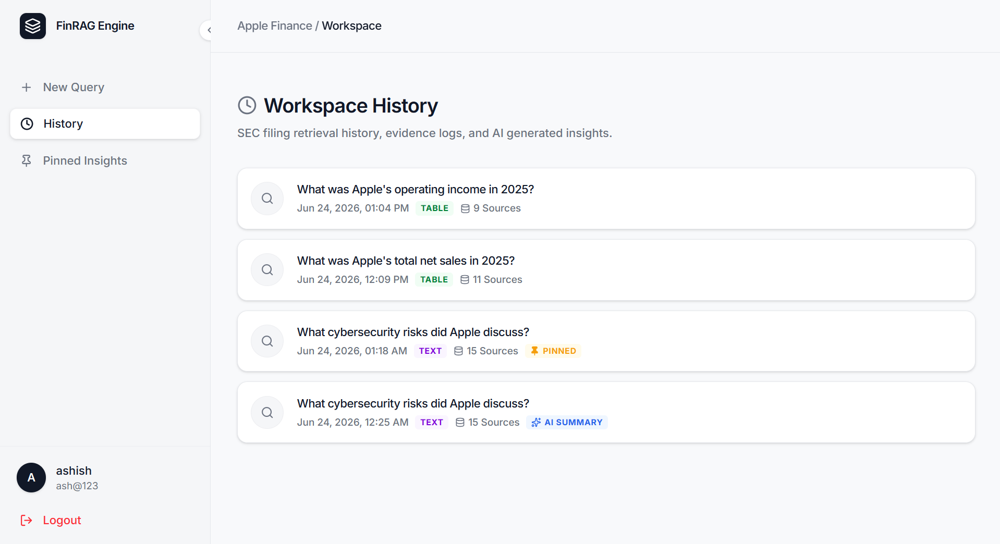
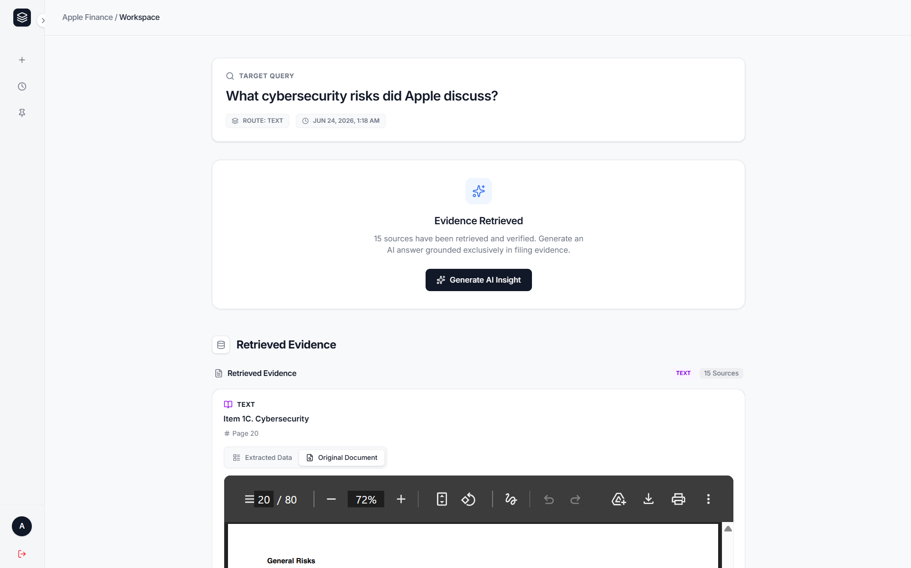

# FinRAG Engine

> A production-style Retrieval-Augmented Generation platform for financial document intelligence — built on hybrid retrieval, query routing, and grounded AI generation.

Currently indexed on **Apple's 2025 Form 10-K** filing. Ask natural language questions, get answers backed by cited SEC sources.

---

## Quick Snap

| View | Preview |
|------|---------|
| **Ask a Question** |  |
| **Answer with Sources** |  |
| **Workspace History** |  |
| **Workspace Detail** |  |

---

## What It Does

Ask questions like:
- *What was Apple's total net sales in 2025?*
- *What cybersecurity risks did Apple discuss?*
- *What was operating income in 2025?*
- *What were Services revenues in 2025?*

The system retrieves evidence directly from the SEC filing and generates answers **only from that evidence** — no model hallucination, no external knowledge.

---

## Architecture

```
React Frontend
      ↓
Node.js / Express  (Auth · Workspaces · Query History)
      ↓
FastAPI RAG Microservice
      ↓
ChromaDB (Vector) + BM25 (Keyword)
      ↓
Gemini 2.5 Flash
```

MongoDB handles users, workspaces, pinned queries, and history — completely separate from the retrieval pipeline.

---

## Retrieval Pipeline

```
Query
  ↓
Query Router  ─────────────────────────────────────────┐
  │                                                    │
  ▼ TEXT route                              TABLE route│
Vector Search + BM25                   Table Collection│
  ↓                                         (no rerank)│
Reciprocal Rank Fusion                                 │
  ↓                                                    │
Context Expansion  (chunk-1 · chunk · chunk+1)         │
  ↓                                                    │
Reranking  (ms-marco-MiniLM-L-12-v2)                   │
  ↓ ◄──────────────────────────────────────────────────┘
Context Builder  →  Gemini 2.5 Flash  →  Grounded Answer
```

**Query Routing** classifies each question before retrieval:
- **Table route** — revenue, net sales, EPS, operating income, cash flow → searches table collection, bypasses reranking, returns exact figures
- **Text route** — cybersecurity, risk factors, governance, supply chain → searches text collection, full reranking pipeline

---

## Tech Stack

| Layer | Technologies |
|-------|-------------|
| **Frontend** | React, Vite, Tailwind CSS, Framer Motion, React Router, Lucide React |
| **Backend** | Node.js, Express, MongoDB, Mongoose, JWT, bcryptjs |
| **RAG Microservice** | FastAPI, ChromaDB, BAAI/bge-large-en-v1.5, rank-bm25, Sentence Transformers, Docling |
| **Generation** | Gemini 2.5 Flash via google-genai SDK |

---

## Dataset

Apple Inc. — Form 10-K, Fiscal Year 2025

| Asset | Count |
|-------|-------|
| Parent sections | 24 |
| Child chunks | 255 |
| Financial tables | 48 |

The architecture is document-agnostic — additional SEC filings can be ingested without changing retrieval logic.

---

## Getting Started

### Prerequisites

- Node.js ≥ 18
- Python ≥ 3.10
- MongoDB (local or Atlas)
- Google Gemini API key

---

### 1. Clone the repository

```bash
git clone https://github.com/AshishSinsinwal/finrag-engine.git
cd finrag-engine
```

---

### 2. RAG Microservice (FastAPI)

```bash
cd backend/python/app
python -m venv venv
source venv/bin/activate        # Windows: venv\Scripts\activate
pip install -r requirements.txt
```

Create a `.env` file inside `backend/python/app/`:

```env
GEMINI_API_KEY=your_gemini_api_key_here
```

Ingest the document and start the service:

```bash
python ingest.py                # Parse PDF, build ChromaDB + BM25 index
uvicorn main:app --reload --port 8000
```

---

### 3. Backend (Node.js / Express)

```bash
cd backend/node
npm install
```

Create a `.env` file inside `backend/node/`:

```env
MONGO_URI=mongodb://localhost:27017/finrag
JWT_SECRET=your_jwt_secret_here
RAG_SERVICE_URL=http://localhost:8000
PORT=5000
```

```bash
npm run dev
```

---

### 4. Frontend (React)

```bash
cd frontend
npm install
```

Create a `.env` file inside `frontend/`:

```env
VITE_API_BASE_URL=http://localhost:5000
```

```bash
npm run dev
```

Open [http://localhost:5173](http://localhost:5173)

---

## Project Structure

```
finrag-engine/
├── frontend/                   # React + Vite app
│   ├── assets/                 # Screenshots & static assets
│   └── src/
│       ├── pages/
│       ├── components/
│       └── ...
│
├── backend/
│   ├── node/                   # Node.js / Express API
│   │   ├── routes/
│   │   ├── models/
│   │   ├── middleware/
│   │   └── ...
│   │
│   └── python/
│       └── app/                # FastAPI RAG Microservice
│
└── README.md
```

---

## Example Results

**Q: What was Apple's total net sales in 2025?**
Retrieved: Financial Statement Table
**A: $416.161 Billion**

---

**Q: What cybersecurity risks did Apple discuss?**
Retrieved: Item 1A Risk Factors · Item 1C Cybersecurity
**A:** Summary covering hacking risks, ransomware, unauthorized access, supplier security, and incident response obligations.

---

## Features

- **JWT Authentication** — registration, login, protected routes
- **Workspace System** — every query saved with full context, route type, sources, and timestamp
- **Query History** — review and revisit previous research sessions
- **Workspace Detail View** — inspect retrieved evidence, source sections, and chunk content
- **Pinning** — bookmark important workspaces
- **Deletion** — clean up your history

---

## Roadmap

- [ ] Multi-company SEC filing support
- [ ] Automated filing ingestion pipeline
- [ ] User document uploads
- [ ] Streaming responses
- [ ] Citation highlighting inside PDFs
- [ ] Multi-document retrieval
- [ ] Retrieval observability and analytics
- [ ] Cloud deployment & horizontal scaling
- [ ] Advanced evaluation framework

---

## License

MIT